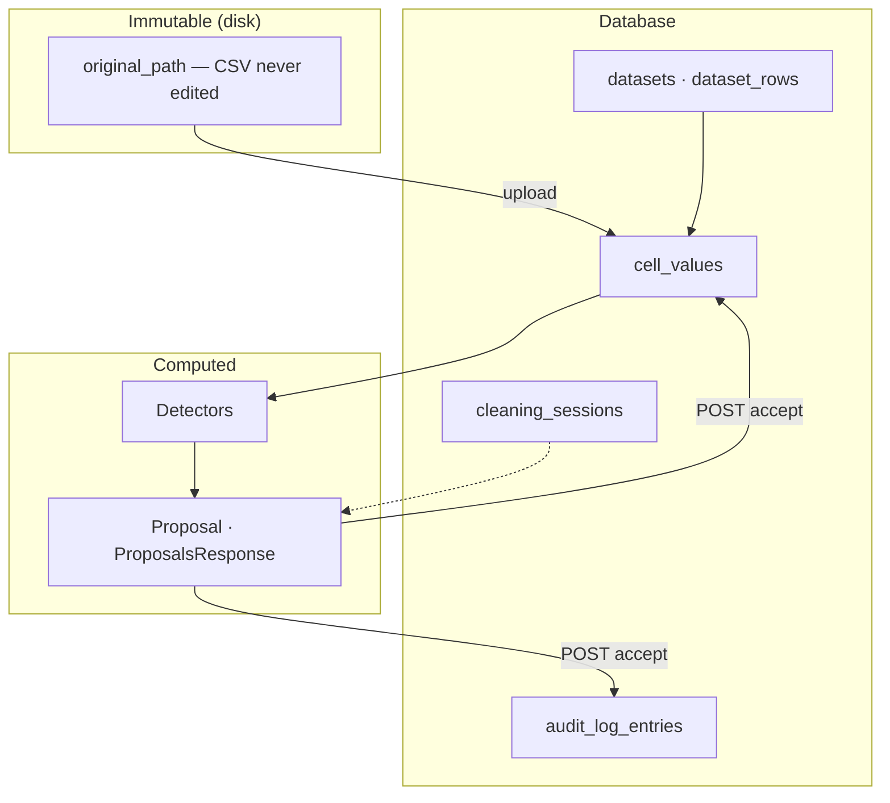
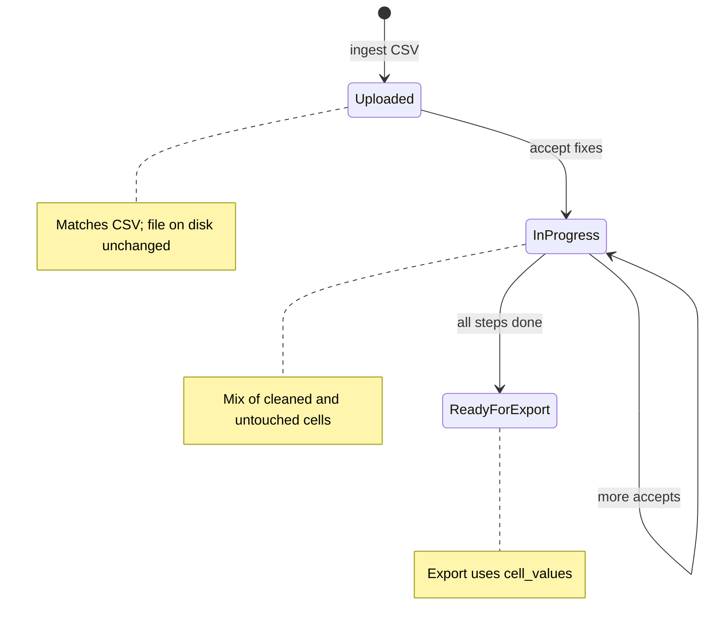
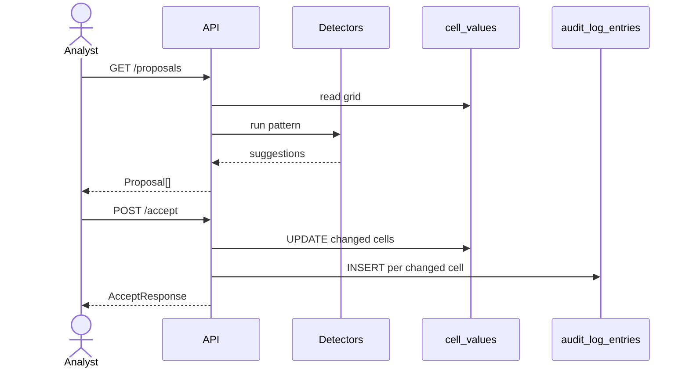
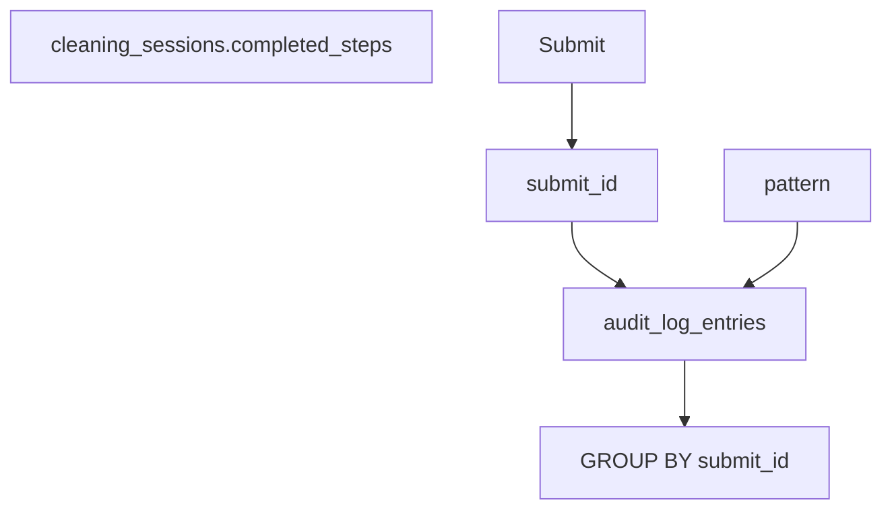
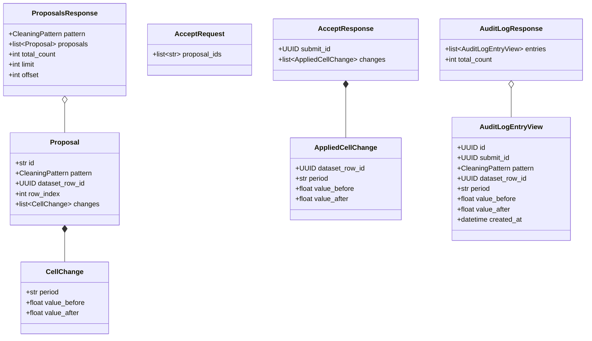

# Database schema

Persisted tables and API DTOs. Behavior and scale: [`architecture.md`](../architecture.md). Code: [`schemas/database.py`](../schemas/database.py), [`schemas/api.py`](../schemas/api.py).

## Entity-relationship

```mermaid
erDiagram
  datasets ||--o{ dataset_rows : contains
  datasets ||--o{ cleaning_sessions : "cleaned via"
  dataset_rows ||--o{ cell_values : "has cells"
  cleaning_sessions ||--o{ audit_log_entries : "change log"
  dataset_rows ||--o{ audit_log_entries : "which row"

  datasets {
    string id PK
    string name
    datetime uploaded_at
    string original_path
    json period_columns
  }

  dataset_rows {
    string id PK
    string dataset_id FK
    int row_index
    string dimension_a
    string dimension_b
    string dimension_c
  }

  cell_values {
    string dataset_row_id PK_FK
    string period PK
    float value
  }

  cleaning_sessions {
    string id PK
    string dataset_id FK
    string current_step
    json completed_steps
    datetime created_at
    datetime updated_at
  }

  audit_log_entries {
    string id PK
    string session_id FK
    string submit_id
    string pattern
    string dataset_row_id FK
    string period
    float value_before
    float value_after
    datetime created_at
  }
```

## Storage



## Working grid



## Accept flow



## Audit



## API models

Not persisted. `Proposal.id` is a step-scoped accept key, not a DB PK.



## Field mapping

| Field | Pydantic | SQL | Notes |
|-------|----------|-----|-------|
| `id` | `UUID` | `TEXT` | All tables |
| `submit_id` | `UUID` | `TEXT` | Groups one Submit; not a FK |
| `uploaded_at`, `created_at`, … | `datetime` | `TIMESTAMPTZ` | UTC |
| `original_path` | `str` | `TEXT` | Immutable CSV key |
| `period_columns` | `list[str]` | `JSON` | Ordered month headers |
| `row_index` | `int` ≥ 0 | `INTEGER` | Line in original file |
| `dimension_*` | `str \| None` | `TEXT` | Nullable |
| `period` | `str` | `TEXT` | `YYYYMM` |
| `value`, `value_before`, `value_after` | `float` | `REAL` | |
| `current_step`, `pattern` | `CleaningPattern` | `TEXT` | |
