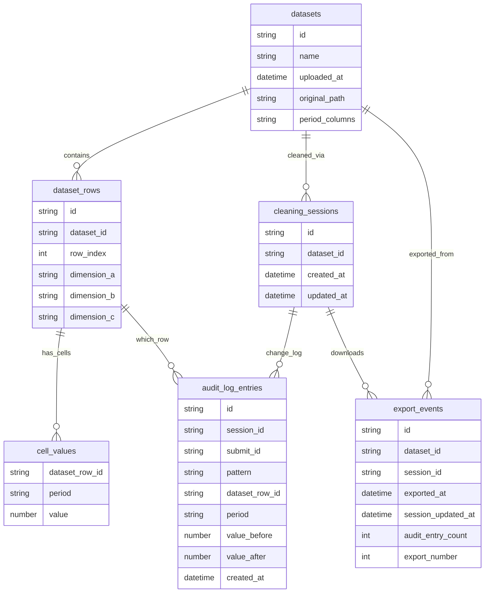
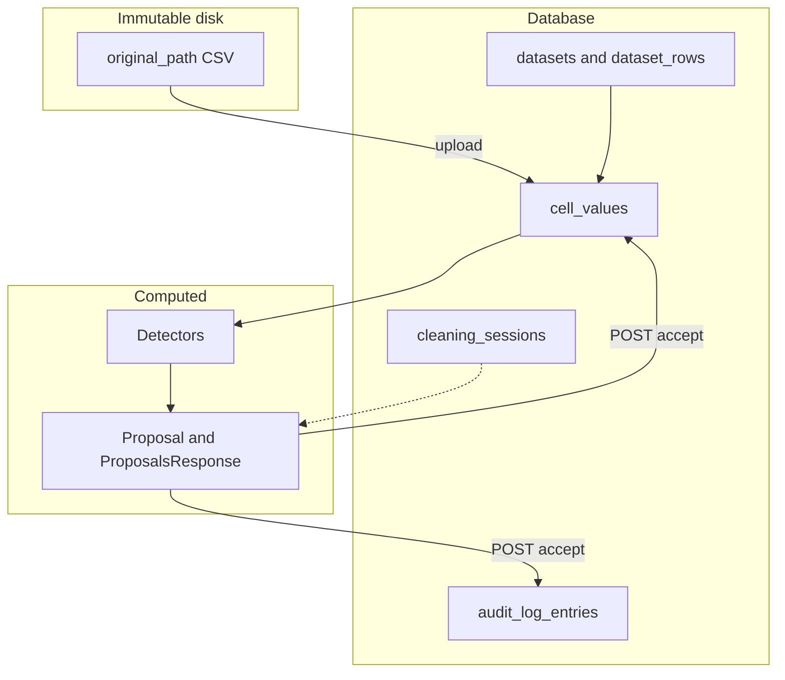
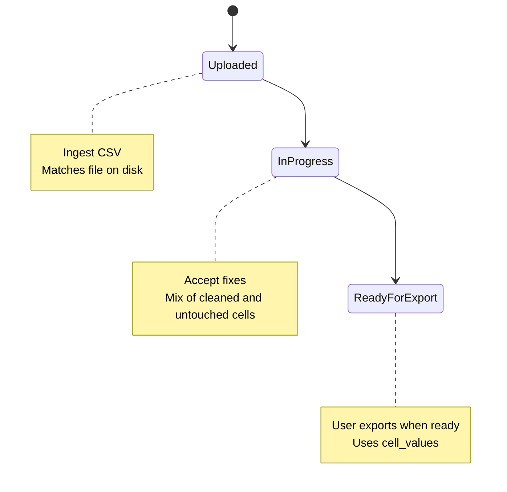
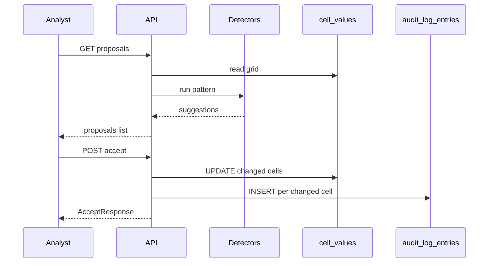
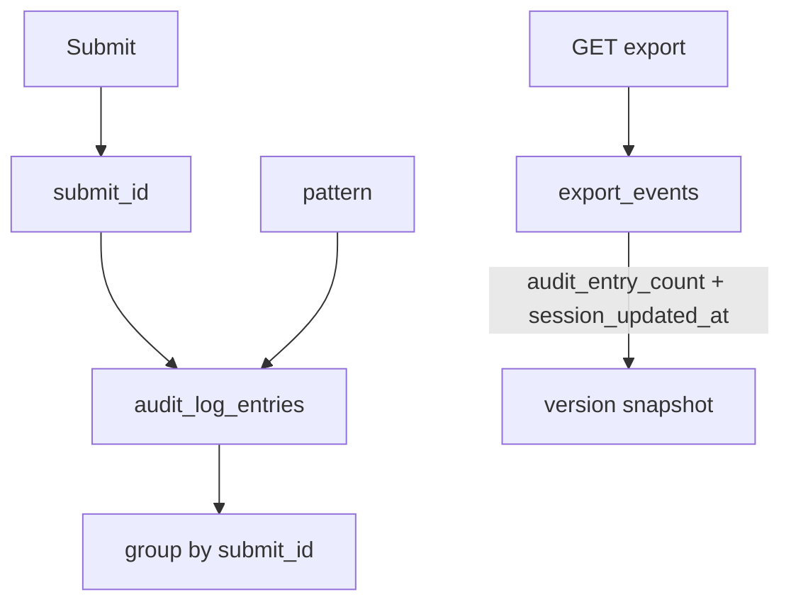
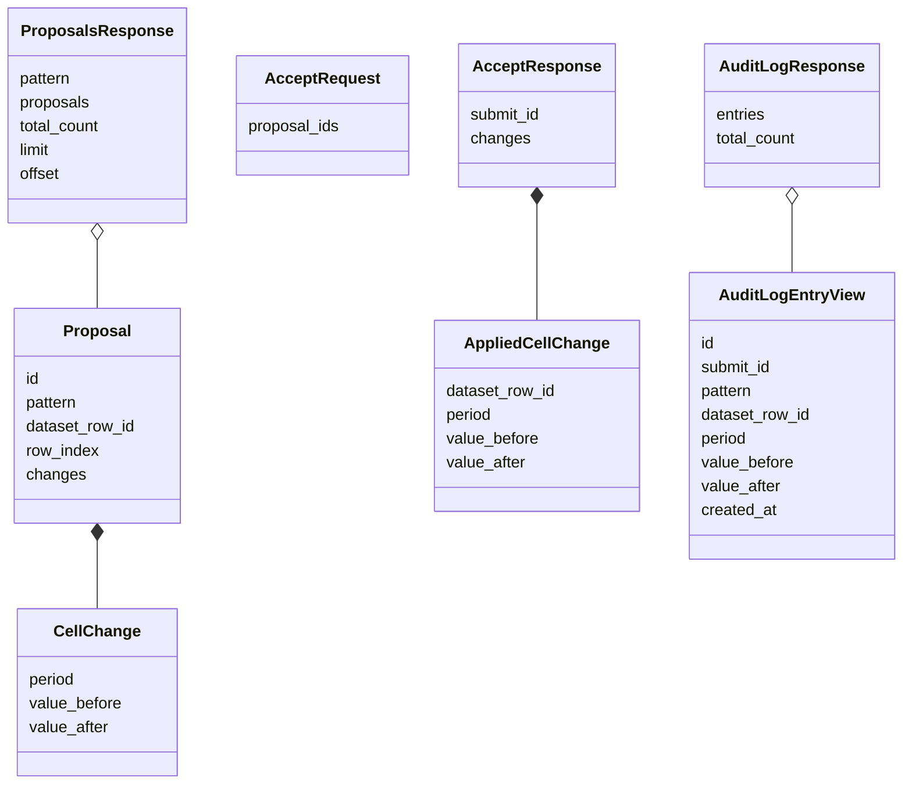

# Database schema

Persisted tables and API DTOs. Product context: [`README.md`](../README.md). Code: [`schemas/database.py`](../schemas/database.py), [`schemas/api.py`](../schemas/api.py).

## Entity-relationship

Composite PK on `cell_values`: `(dataset_row_id, period)`. Keys shown on relationship lines only (GitHub Mermaid does not reliably render PK/FK on attributes).

## Storage

## Working grid

## Accept flow

## Audit

**Cell changes** (`audit_log_entries`): one row per accepted cell, grouped by `submit_id`.

**Exports** (`export_events`): one row per CSV download — `exported_at`, `export_number`, plus snapshots `session_updated_at` and `audit_entry_count` so downloads can be matched to how much cleaning had happened. Analyst identity is not stored in v1.

## UI vs database

| Concern | Stored in DB | Stored in frontend |
|---------|--------------|-------------------|
| Which tab is open | No | `activePattern` (nullable) |
| Which patterns have issues | No (computed) | `patternCounts` from `GET .../proposals` `total_count` |
| Checkbox selection | No | Per active pattern |
| Working cell values | `cell_values` | — |
| Change history | `audit_log_entries` | — |
| CSV downloads | `export_events` | — |

## API models

Not persisted. `Proposal.id` is a step-scoped accept key, not a DB PK.

## Field mapping

| Field | Pydantic | SQL | Notes |
|-------|----------|-----|-------|
| `id` | `UUID` | `TEXT` | All tables |
| `submit_id` | `UUID` | `TEXT` | Groups one Submit; not a FK |
| `uploaded_at`, `created_at`, … | `datetime` | `TIMESTAMPTZ` | UTC |
| `original_path` | `str` | `TEXT` | Immutable CSV key |
| `period_columns` | `list[str]` | `JSON` | Ordered month headers |
| `row_index` | `int` ≥ 0 | `INTEGER` | Line in original file |
| `dimension_*` | `str \| None` | `TEXT` | Nullable |
| `period` | `str` | `TEXT` | `YYYYMM` |
| `value`, `value_before`, `value_after` | `float` | `REAL` | |
| `pattern` (audit only) | `CleaningPattern` | `TEXT` | Which anomaly type was accepted |
